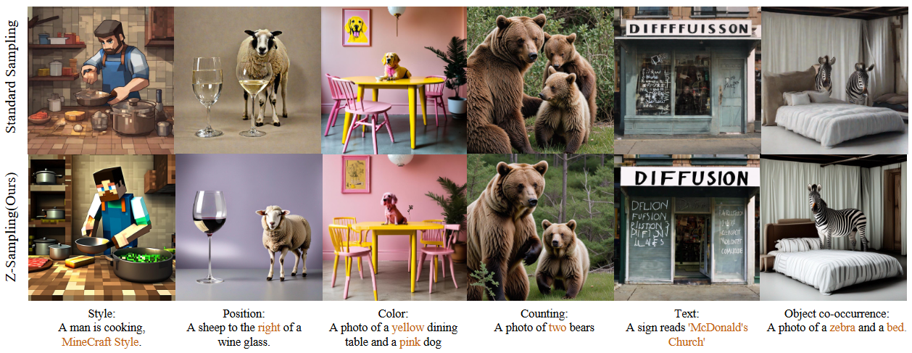
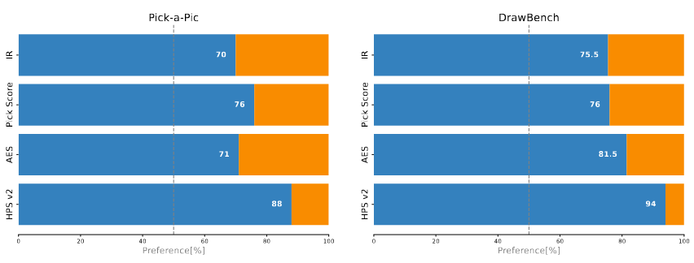

# Zigzag Diffusion Sampling (Z-Sampling)

## News 🚀️

Our paper 'Z-Sampling' has been accepted by ICLR 2025. 🎉🌸🎉

## Overview

This guide provides instructions on how to use Z-Sampling, a novel sampling method that leverages the guidance gap to accumulate semantic information step-by-step throughout the entire generation process.

Here we provide the inference code which supports ***Stable Diffusion XL***. More architectures will be released later.

## Results

<div align="center">
  
</div>
**The qualitative results of Z-Sampling demonstrate the effectiveness of our method in various aspects, such as style, position, color, counting, text rendering, and object co-occurrence.**

<div align="center">
  
</div>
**The winning rates of Z-Sampling over standard sampling. The blue bars represent the side of our method. The orange bars represent the side of the standard sampling**

## Requirements

- `python version == 3.10.14`
- `pytorch with cuda version`
- `diffusers == 0.22.3`
- `PIL`
- `numpy`
- `timm`
- `tqdm`
- `argparse`
- `einops`

## Installation

Make sure you have successfully built `python` environment and installed `pytorch` with cuda version. Before running the script, ensure you have all the required packages installed. Specifically, you need to install the `diffusers` library with a specific version.

```bash
pip install diffusers == 0.22.3
```

## Usage👀️ 

To use the Z-Sampling pipeline, you need to run the `infer.py` with appropriate command-line arguments. Below are the available options:

### Command-Line Arguments

- `--gamma_1`: The classifier-free guidance scale used in the denoising process. Default is 5.5.
- `--gamma_2`: The classifier-free guidance scale used in the inversion process. Default is 0.
- `--infer_step`: Number of inference steps for the diffusion process. Default is 50.
- `--lambda_step`: Number of zigzag iteration steps for the diffusion process. Default is 49.
- `--image_size`: The size (height and width) of the generated image.  Default is 1024.
- `--T_max`: Number of rounds for each zigzag iteration step. Default is 1.
- `--seed`: Random seed to determine the initial latent. Default is 42.
- `--device`: Device where the model inference is performed. Default is `cuda`.
- `--save_dir`: Path to save the generated images. Default is `./res`.

### Running the Script

You can execute the inference step by running the following command:
```bash
python ./infer.py
```
This command will execute the generation process, generating images corresponding to the `predefined prompts` under both `Standard sampling` and `Z-Sampling`.

The `predefined prompts` are as
```python
prompt_list = ["A Man on a Bicycle, MineScaft Style", 
               "A small yellow dog.",
               "A Man on a Bicycle, in the style of Van Gogh's Starry Night."]
```
You can also modify these prompts in `infer.py` to the content you want.


### Output🎉️ 

The script will save two images:

- A standard image generated by the `standard sampling`.
- A optimized image generated by the `Z-Sampling`.

Both images will be saved in the `--save_dir` with names based on the method and prompt.

## Citation

```bibtex
@inproceedings{
bai2024zigzag,
title={Zigzag Diffusion Sampling: Diffusion Models Can Self-Improve via Self-Reflection},
author={Bai, Lichen and Shao, Shitong and Zhou, Zikai and Qi, Zipeng and Xu, Zhiqiang and Xiong, Haoyi and Xie, Zeke},
booktitle={The Thirteenth International Conference on Learning Representations},
year={2025},
url={https://openreview.net/forum?id=MKvQH1ekeY}
}
```

## Pre-trained Weights Download❤️

You need to manually or automatically download the SDXL model via Hugging Face. Please ensure a stable internet connection and the correct version.

If you encounter any issues with deployment and operation, you are kindly invited to contact us, thank you very much!
